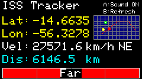
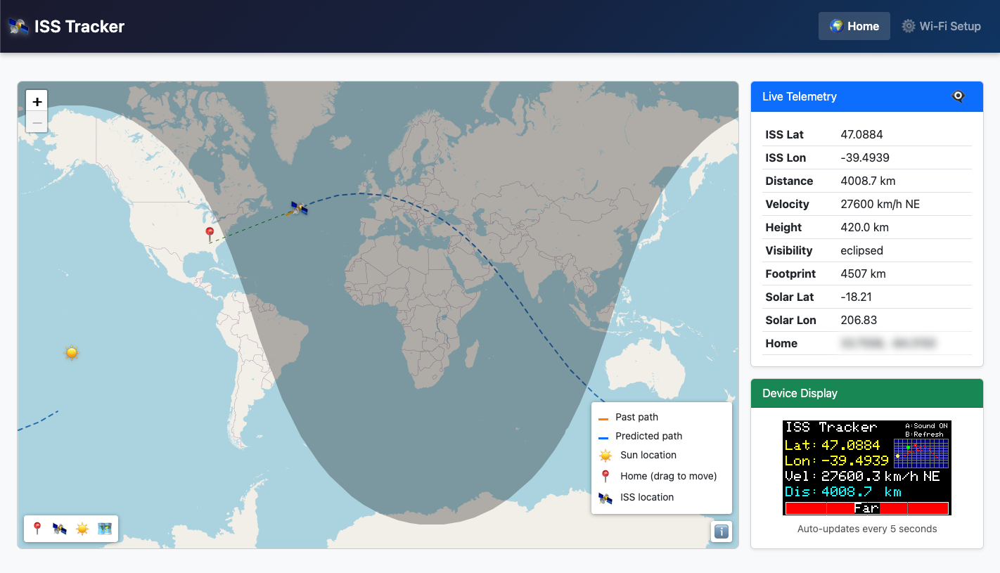

# ISS Tracker — M5StickC Plus

A compact ISS tracker project for the M5StickC Plus (ESP32-based) with both on-device display and web UI. The device shows real-time ISS position, distance, velocity, and a mini-map with 1-hour prediction path. A full-featured web interface provides interactive map tracking and configuration.

## What this repository contains

- `ISS_Tracker_M5StickCPlus.ino` — Main Arduino sketch for the M5StickC Plus.
- `user_settings.h` — Project configuration: Wi‑Fi credentials, API keys and other user-editable settings.
- `upload_littlefs.sh` — Bash script for uploading LittleFS filesystem (macOS/Linux).
- `data/` — Static web files (served from LittleFS):
  - `index.html` — Main web UI with interactive map.
  - `setup.html` — Setup/configuration UI.
  - `app.js`, `setup.js` — JavaScript for the web UI.
  - `style.css` — Styling for the web pages.

> Note: The web files in `data/` must be uploaded to the device filesystem (LittleFS) separately from the sketch.

## Features

### On-Device Display (M5StickC Plus)
- Real-time ISS latitude, longitude, distance, and velocity
- Mini-map showing:
  - Home location (green dot)
  - Current ISS position (red dot)
  - Sun position (yellow dot)
  - 1-hour prediction path (red dotted line)
- Proximity indicator bar (color-coded: green/yellow/orange/red)
- Audio/visual alerts when ISS is within 800km
- Button controls: A (toggle sound), B (refresh data)

### Web Interface
- Interactive Leaflet map with day/night terminator
- Real-time ISS tracking with past track history
- 1-hour orbital prediction (blue dotted line)
- Draggable home location marker
- Detailed telemetry display
- WiFi configuration and network scanning
- Screenshot capture via `/screen.bmp`

### Technical Features
- Runs on M5StickC Plus (ESP32) hardware
- HTTPS API integration with wheretheiss.at
- Captive portal for initial WiFi setup
- mDNS support (`http://iss.local/`)
- LittleFS filesystem for web assets
- Track persistence across reboots (NDJSON format)
- JSON API endpoints for integration

## Screenshots

Below are a couple of screenshots from the device and web UI.



_On-device display and basic status screen._



_Web UI map / pass prediction view._

## Requirements

- macOS, Windows, or Linux development machine
- Arduino IDE 2.x or Arduino CLI with ESP32 board support
- M5StickC Plus (ESP32-PICO-D4) device
- USB-C cable for programming
- **For LittleFS uploads (command-line method):**
  - `mklittlefs` — Install via Homebrew: `brew install mklittlefs`
  - `esptool` — Install via Homebrew: `brew install esptool`
- **Libraries** (install via Arduino Library Manager):
  - M5StickCPlus (v2.x)
  - ArduinoJson (v6.x)
  - WiFi, WiFiClientSecure, HTTPClient (included with ESP32 core)

If the compiler reports missing libraries, install them through Arduino IDE > Tools > Manage Libraries...

## Setup

### 1. Install ESP32 Board Support

In Arduino IDE:
- **File > Preferences**, add the ESP32 boards URL:
  ```
  https://raw.githubusercontent.com/espressif/arduino-esp32/gh-pages/package_esp32_index.json
  ```
- **Tools > Board > Boards Manager** → search for "esp32" and install.
- **Tools > Board** → Select "M5StickC" or "M5StickC-Plus"
- **Tools > Partition Scheme** → Select "Huge APP (3MB No OTA/1MB SPIFFS)"

### 2. Install Required Libraries

**Tools > Manage Libraries**, then search and install:
- `M5StickCPlus` by M5Stack
- `ArduinoJson` by Benoit Blanchon

### 3. Configure Settings (Optional)

Edit `user_settings.h` to set your home location and optional WiFi credentials:
```cpp
// WiFi credentials (optional - can be configured via web portal)
#define WIFI_SSID ""        // Leave empty to use portal
#define WIFI_PASSWORD ""    // Leave empty to use portal

// Home location (required for distance calculations)
#define HOME_LAT 37.7749    // Your latitude
#define HOME_LON -122.4194  // Your longitude

// API token (optional - for /loc endpoint security)
#define LOC_TOKEN ""        // Leave empty for no authentication
```

**Note**: It's recommended to configure WiFi via the captive portal on first boot rather than hardcoding credentials.

### 4. Upload LittleFS Filesystem

The web UI files must be uploaded to the device filesystem separately.

#### Option A: Command-Line Script (macOS/Linux - Recommended)

1. **Install tools** (if not already installed):
   ```bash
   brew install mklittlefs esptool
   ```

2. **Run the upload script**:
   ```bash
   chmod +x upload_littlefs.sh
   ./upload_littlefs.sh
   ```

The script will:
- Auto-detect your M5StickC Plus on USB
- Create a LittleFS image from the `data/` folder
- Upload to the correct partition (0x310000)
- Clean up temporary files

#### Option B: Arduino IDE Plugin

1. **Install the plugin**:
   - Download from: https://github.com/lorol/arduino-esp32littlefs-plugin/releases
   - Extract to `~/Documents/Arduino/tools/` (create `tools` folder if needed)
   - Restart Arduino IDE

2. **Upload filesystem**:
   - Close Serial Monitor if open
   - **Tools > ESP32 Sketch Data Upload**
   - Wait for upload to complete

### 5. Upload the Sketch

1. Connect M5StickC Plus via USB
2. Select correct port: **Tools > Port**
3. Click **Upload** button in Arduino IDE
4. Watch the upload progress in the IDE output window

### 6. Initial WiFi Setup

**On first boot (or when no WiFi is saved):**
1. Device automatically starts in **Access Point mode**
2. Device screen shows: "Setup Wi-Fi @: http://192.168.4.1"
3. Look for WiFi network: `ISS-Setup-XXXX` (XXXX = last 4 chars of MAC address)
4. Connect to this network with your phone or computer
5. Open browser to `http://192.168.4.1/setup.html`
6. Select your WiFi network from the scan list
7. Enter password and click Save
8. Device will reboot and connect to your network

**After WiFi is configured:**
- Device shows "Wi-Fi ok" with IP address on screen
- Access web UI at `http://iss.local/` (or use device's IP address if mDNS doesn't work)
- Main UI: `http://iss.local/` or `http://iss.local/index.html`
- Setup page: `http://iss.local/setup.html`

**To reconfigure WiFi:**
- Visit `http://iss.local/setup.html` and click "Forget WiFi"
- Device will reboot into Access Point mode

## Usage

### On-Device Controls
- **Button A**: Toggle sound on/off
- **Button B**: Force refresh ISS data

### Web Interface Endpoints
- `/` or `/index.html` — Interactive map and telemetry
- `/setup.html` — WiFi configuration and network scan
- `/iss.json` — Current ISS data (JSON API)
- `/track.json?mins=60` — Past track history (default: 60 minutes)
- `/predict.json` — 1-hour prediction data
- `/config.json` — Device configuration
- `/screen.bmp` — Current device screen capture (24-bit BMP)
- `/loc` — Get/set home location (requires token if configured)

### API Examples

**Get current ISS data:**
```bash
curl http://iss.local/iss.json
```

**Get last 2 hours of tracking:**
```bash
curl http://iss.local/track.json?mins=120
```

**Update home location:**
```bash
curl -X POST http://iss.local/loc \
  -H "Content-Type: application/json" \
  -d '{"lat": 40.7128, "lon": -74.0060, "token": "your-token"}'
```

## Customization

- **Home Location**: Edit `HOME_LAT` and `HOME_LON` in `user_settings.h`, or drag the green marker in the web UI
- **WiFi Configuration**: Use the captive portal (`http://192.168.4.1/setup.html`) or setup page when connected
- **Web UI**: Modify files in `data/` folder, then re-upload filesystem
- **Alert Range**: Change `RADIUS_KM` and `HYST_KM` constants in the `.ino` file
- **Fetch Interval**: Adjust `FETCH_INTERVAL_MS` (default: 5 seconds)
- **Mini-map**: Toggle with `SHOW_MINIMAP` constant in `drawMiniMap()` function
- **API Security**: Set `LOC_TOKEN` in `user_settings.h` to require authentication for location changes

## Troubleshooting

### Device won't connect to WiFi
- Use captive portal to configure WiFi (device automatically starts in AP mode on first boot)
- Ensure 2.4GHz WiFi (ESP32 doesn't support 5GHz)
- Try forgetting WiFi via `http://iss.local/setup.html` and reconfigure
- Check device screen for status messages ("Wi-Fi ok" or "Setup Wi-Fi @...")
- If hardcoded credentials in `user_settings.h`, verify SSID/password are correct

### Web UI shows "index.html not found"
- **Filesystem not uploaded correctly**. The LittleFS upload is separate from sketch upload.
- Verify partition scheme is "Huge APP" in Arduino IDE
- Use `upload_littlefs.sh` script with correct parameters:
  - Partition offset: `0x310000`
  - Partition size: `917504` bytes
- Re-upload filesystem using Arduino IDE plugin or script

### Libraries missing
- Install via **Tools > Manage Libraries** in Arduino IDE
- Required: `M5StickCPlus`, `ArduinoJson`
- ESP32 core libraries (WiFi, HTTPClient) are included automatically

### Can't access http://iss.local/
- mDNS may not work on all networks
- Check device screen for IP address after WiFi connects
- Use IP address directly (example: `http://192.168.1.123/`)
- Ensure computer and device are on same network/VLAN

### Upload script fails
- Check USB connection and port detection
- Verify tools installed: `which mklittlefs esptool`
- Try lower baud rate in script (115200 instead of 460800)
- Make sure device is connected and port is correct

### Prediction line not showing
- Requires at least 2 ISS samples to calculate bearing/velocity
- Wait ~10 seconds after boot for data collection
- Prediction refreshes every 60 seconds

### Display issues
- If screen is blank, check `M5.Axp.ScreenBreath(15)` setting
- Adjust brightness: values 8-15 (15 = brightest)
- Verify sprite buffer creation succeeds (240x135x2 = ~63KB RAM)
- Check device is powered on (press power button for 2 seconds)

## Development Notes

- **Partition scheme**: Uses `huge_app` (3MB app / 1MB filesystem)
- **LittleFS location**: Starts at `0x310000`, size `917504` bytes (896KB)
- **Track persistence**: Appends to `/track.ndjson` in NDJSON format
- **Sprite buffer**: Uses TFT_eSprite (in-memory framebuffer) for screenshot capability
- **HTTPS**: Uses `WiFiClientSecure` with `setInsecure()` for wheretheiss.at API
- **Memory**: ~63KB used for sprite buffer, track data is file-based (no RAM history)
- **No Serial output**: Device operates without Serial Monitor - all info displayed on screen/web UI
